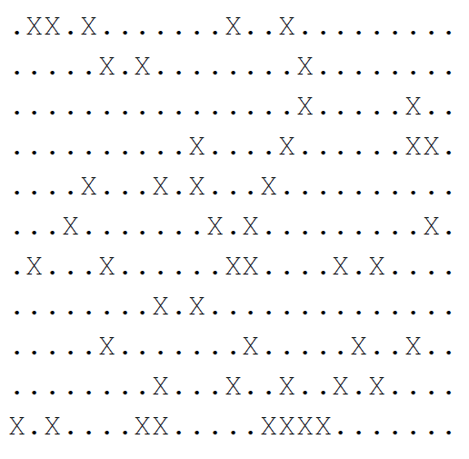

# Project 4: iceberg avoidance

CPSC 335 - Algorithm Engineering
Spring 2020

## Abstract

In this project you will implement two algorithms that both solve the​ _iceberg avoidance problem_. ​ The first
algorithm uses exhaustive search, is similar to the exhaustive search algorithm from project 2, and takes
exponential time. The second algorithm uses dynamic programming, and takes quadratic time.

## The Hypothesis

This experiment will test the following hypothesis: Polynomial-time dynamic programming algorithms are
more efficient than exponential-time exhaustive search algorithms that solve the same problem.

## The Iceberg Avoidance Problem

The “iceberg avoidance problem” is a puzzle that comes from real life, where ships have to travel through
iceberg ridden water in order to find safe passage to reach their destination. For example, we could consider
supply ships trying to reach habited places in Antarctica. But due to global warming or changes in the ocean
salinity, there are icebergs (that we consider stationary) of various sizes that are impassable. The ship starts in
Chile which is represented by one corner of a matrix (location [0][0]) and needs to reach safely Antarctica,
represented by the corner across the ocean (location [r-1][c-1]). The icebergs are impenetrable and crossing
the ocean can be done only moving right, from location [i][j] to location [i][j+1], or down, from location [i][j]
to [i+1][j]. There is no path that can go through an iceberg so the ship can move into a new location if there
is no iceberg at that location. We will represent the part of the ocean area as a 2D grid, like the following:

The ship starts at row 0 and column 0, i.e. coordinate (0, 0), at the top-left corner. Each ​.​ cell represents clear
water (i.e. a passable spot) and each ​X​ represents an iceberg (i.e. an impenetrable spot). The ship’s goal is to
plan a passable route to cross the ocean while avoiding the icebergs. The problem objective is to compute the
number of different paths to cross the ocean. Two paths are different if they differ by at least one spot.

For the previous grid, the optimal solution is **17625**

We can define this puzzle as an algorithmic problem.

_Iceberg avoidance problem_  
**input:** ​ a r⨉c matrix G where each cell is one of. (passable) or X (impassable); and G[0][0]= .  
**output:** ​the number of different paths starting at (0, 0) ​**and end at location [r-1][c-1]** ; where each
step is either a start, right move, or down move; that does not visit any X cell

If the initial cell is blocked, there is no way of moving anywhere so output 0.  
If the final cell is an iceberg, output 0.

### The Exhaustive Optimization Algorithm

Our first algorithm solving the iceberg avoidance problem is exhaustive. The output definition says that the
number of different paths, so this is an exhaustive search algorithm that keeps a counter and does not return
after such a path is found but increment the counter instead.

The following is a first draft of the exhaustive search algorithm.

iceberg_avoidance_exhaustive(G):  
&nbsp;&nbsp;&nbsp;maxno = total number of different paths originating at (0,0) and ending at (r-1,c-1)  
&nbsp;&nbsp;&nbsp;counter = 0 (number of valid paths in G  
&nbsp;&nbsp;&nbsp;for len from 0 to maxno inclusive:
&nbsp;&nbsp;&nbsp;for each possible sequence S of {→, ↓} encoded as len:  
&nbsp;&nbsp;&nbsp;&nbsp;&nbsp;&nbsp;candidate = [start] + S  
&nbsp;&nbsp;&nbsp;&nbsp;&nbsp;&nbsp;if candidate is valid:  
&nbsp;&nbsp;&nbsp;&nbsp;&nbsp;&nbsp;&nbsp;&nbsp;&nbsp;counter++  
&nbsp;&nbsp;&nbsp;return counter

This is not quite clear, because the precise value of maxno, method of generating the sequences S, and
verifying candidates, are all vague.

Since all paths start at (0, 0) and the only valid moves are right and down, valid paths are never backward or
upward. So any valid path must reach the bottom-right corner of the grid. The grid has r rows and c columns,
so this path involves (r-1) down moves and (c-1) right moves, for a total of n = r + c - 2 moves.

There are two kinds of move, down ↓ and right →. Coincidentally there are two kinds of bits, 0 and 1. So we
can generate move sequences by generating bit strings, using the same method that we used to generate
subsets in section 6.5.4 of ADITA. We loop through all binary numbers from 0 through 2_n_ − 1 , and interpret the bit at position ​ k ​ as the up/down step at index ​ k.

A candidate path is valid when it follows the rules of the iceberg avoidance problem. That means that the
path stays inside the grid, and never crosses an iceberg (X) cell.

Combining these ideas gives us a complete and clear algorithm.

iceberg_avoiding_exhaustive(G):  
&nbsp;&nbsp;&nbsp;len = r + c -  
&nbsp;&nbsp;&nbsp;counter = 0  
&nbsp;&nbsp;&nbsp;for bits from 0 to 2​len ​- 1 inclusive:  
&nbsp;&nbsp;&nbsp;&nbsp;&nbsp;&nbsp;candidate = [start]  
&nbsp;&nbsp;&nbsp;&nbsp;&nbsp;&nbsp;for k from 0 to len-1 inclusive:  
&nbsp;&nbsp;&nbsp;&nbsp;&nbsp;&nbsp;&nbsp;&nbsp;&nbsp;bit = (bits >> k) & 1  
&nbsp;&nbsp;&nbsp;&nbsp;&nbsp;&nbsp;&nbsp;&nbsp;&nbsp;if bit == 1:  
&nbsp;&nbsp;&nbsp;&nbsp;&nbsp;&nbsp;&nbsp;&nbsp;&nbsp;&nbsp;&nbsp;&nbsp;candidate.add(→)  
&nbsp;&nbsp;&nbsp;&nbsp;&nbsp;&nbsp;&nbsp;&nbsp;&nbsp;else:  
&nbsp;&nbsp;&nbsp;&nbsp;&nbsp;&nbsp;&nbsp;&nbsp;&nbsp;&nbsp;&nbsp;&nbsp;candidate.add(↓)  
&nbsp;&nbsp;&nbsp;&nbsp;&nbsp;&nbsp;if candidate stays inside the grid and never crosses an X cell:  
&nbsp;&nbsp;&nbsp;&nbsp;&nbsp;&nbsp;&nbsp;&nbsp;&nbsp;&nbsp;&nbsp;&nbsp;counter++  
&nbsp;&nbsp;&nbsp;**return counter**

Let _n_ = _r_ + _c_ − 2. Then the for loop over bits repeats _O_(2_n_) times, and the inner for loops repeat _O_(_n_)
times, and the total run time of this algorithm is _O_(_n_ 2_n_). This is a very slow algorithm.

### The Dynamic Programming Algorithm

This problem can also be solved by a dynamic programming algorithm. This dynamic programming matrix A
stores partial solutions to the problem. In particular,

A[r][c] = the number of different valid paths that start at (0, 0) and end at (r-1, c-1); or 0 if (r-1, c-1) is
unreachable

Recall that in this problem, some cells are filled with icebergs and are therefore unreachable by a valid path. The base case is the value for A[0][0], which is the trivial path that starts at (0,0) and takes no subsequent
steps: A[0][0] = 1

We can build a solution for a general case based on pre-existing shorter paths. The ship can only move right
and down. So there are two ways a ship can reach the cell at location (i, j).
1. The path reached the location above (i, j) and with an additional down step reaches (i,j)
2. The path reached the location to the left of (i, j) and with an additional right step reaches (i,j)

The algorithm should add both alternatives, which in this problem means adding different paths.

However, neither of these paths is guaranteed to exist. The from-above path (1.) only exists when we are not
on the top row (so when i>0), and when the cell above (i, j) is not an iceberg. Symmetrically, the from-left
path (2.) only exists when we are not on the leftmost column (so when j>0) and when the cell to the left of (i,
j) is not an iceberg.

Finally, observe that A[i][j] must be None when G[i][j]==X, because a path to (i, j) is only possible when (i, j)
is not an iceberg.

Altogether, the general solution is:

&nbsp;&nbsp;&nbsp;A[i][j] = None and stays None&nbsp;&nbsp;&nbsp;&nbsp;&nbsp;&nbsp;&nbsp;&nbsp;&nbsp;if G[i][j]==X  
&nbsp;&nbsp;&nbsp;A[i][j] = the sum of paths from_above and from_left where  
&nbsp;&nbsp;&nbsp;&nbsp;&nbsp;&nbsp;from_above = 0 if i=0 or G[i-1][j]==X; or A[i-1][j] otherwise (move is [↓])
&nbsp;&nbsp;&nbsp;&nbsp;&nbsp;&nbsp;from_left = None if j=0 or G[i][j-1]==X; or A[i][j-1] otherwise (move is [→])

Putting the parts together yields a complete dynamic programming algorithm.

iceberg_avoidance_dyn_prog(G):  
&nbsp;&nbsp;&nbsp;A = new r⨉c matrix  
&nbsp;&nbsp;&nbsp;#base case  
&nbsp;&nbsp;&nbsp;A[0][0] = 1  
&nbsp;&nbsp;&nbsp;#general cases  
&nbsp;&nbsp;&nbsp;for i from 0 to r-1 inclusive:  
&nbsp;&nbsp;&nbsp;&nbsp;&nbsp;&nbsp;for j from 0 to c-1 inclusive:  
&nbsp;&nbsp;&nbsp;&nbsp;&nbsp;&nbsp;&nbsp;&nbsp;&nbsp;if G[i][j]==X:  
&nbsp;&nbsp;&nbsp;&nbsp;&nbsp;&nbsp;&nbsp;&nbsp;&nbsp;&nbsp;&nbsp;&nbsp;A[i][j]=None  
&nbsp;&nbsp;&nbsp;&nbsp;&nbsp;&nbsp;&nbsp;&nbsp;&nbsp;&nbsp;&nbsp;&nbsp;continue  
&nbsp;&nbsp;&nbsp;&nbsp;&nbsp;&nbsp;&nbsp;&nbsp;&nbsp;from_above = from_left = 0  
&nbsp;&nbsp;&nbsp;&nbsp;&nbsp;&nbsp;&nbsp;&nbsp;&nbsp;if i>0 and A[i-1][j] is not None:  
&nbsp;&nbsp;&nbsp;&nbsp;&nbsp;&nbsp;&nbsp;&nbsp;&nbsp;&nbsp;&nbsp;&nbsp;from_above = A[i-1][j]  
&nbsp;&nbsp;&nbsp;&nbsp;&nbsp;&nbsp;&nbsp;&nbsp;&nbsp;if j>0 and A[i][j-1] is not None:  
&nbsp;&nbsp;&nbsp;&nbsp;&nbsp;&nbsp;&nbsp;&nbsp;&nbsp;&nbsp;&nbsp;&nbsp;from_left = A[i][j-1]  
&nbsp;&nbsp;&nbsp;&nbsp;&nbsp;&nbsp;&nbsp;&nbsp;&nbsp;A[i][j] = sum of from_above and from_left; or None if both from_above and from_left are None  
&nbsp;&nbsp;&nbsp;return A[r-1][c-1]

The time complexity of this algorithm is dominated by the general-case loops. The outer loop repeats _r_
times, the inner loop repeats _c_ times, and with _n_ = _r_ + _c_ − 2 for a total of _O_(_n_2) time. While _O_(_n_2) is not
the fastest time complexity out there, it is polynomial so considered tractible, and is drastically faster than the
exhaustive algorithm.

## Obtaining and Submitting Code

This document explains how to obtain and submit your work:
GitHub Education / Tuffix Instructions
Here is the invitation link for this project:
https://classroom.github.com/g/MqBREPiF

## Implementation

You are provided with the following files.

1. ices_algs.hpp​ is a C++ header that defines two functions, one for each of the algorithms
    defined above. These function bodies are marked TODO and your assignment is to fill them in with
    algorithm implementations.
2. ices_types.cpp​ is a C++ header that defines data types for the grids, paths, and related objects
    for the iceberg avoiding problem. This code is complete; you should not modify this file.
3. ices_timing.cpp​ is a C++ program with a ​main()​ function that measures one experimental
    data point for each of the algorithms. You can expand upon this code to obtain several data points
    for each of your algorithm implementations.
4. Makefile​, ​ices_test.cpp​, ​timer.hpp​, ​rubrictest.hpp​, and ​README.md​ work
    the same way as in prior projects.

## What to Do

Decide on who will be in your team, or decide to work alone; have one of your team members accept the
GitHub assignment by following the invitation link; have any other team members join your team by
following the invitation link; and add your group member names to ​README.md​.
Then, implement each of the two algorithms in C++ using the provided skeleton code. Test your code using
the provided unit tests.

Once you are confident that your algorithm implementations are correct, modify the timing code to gather
numerous data points for the run-time of each of the two algorithms.

#### Finally, produce a brief written project report ​ in PDF format ​. Submit your PDF by committing it to your

GitHub repository along with your code. Your report should include the following:

1. Your names, CSUF-supplied email address(es), and an indication that the submission is for project 4.
2. Three scatter plots:
    a. One showing the time complexity of the exhaustive algorithm.
    b. One showing the time complexity of the dynamic programming algorithm.
    c. One showing the performance of both algorithms together on the same plot. This will
       probably need to be zoomed-in since the exhaustive algorithm is so much slower than the
       dynamic one.
3. Answers to the following questions, using complete sentences.
    a. Are the fit lines on your scatter plots consistent with these efficiency classes? Justify your
       answer.
    b. Is this evidence consistent or inconsistent with the hypothesis stated on the first page?
       Justify your answer.
    c. Compare and contrast the difficulty you found in implementing the two algorithms. What
       was the most challenging part of implementing each algorithm. Overall, which
       implementation did you find harder, and why? Which algorithm implementation do you
       prefer?

